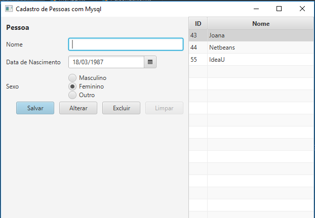

# Examples
Example project demonstrating the use of the mysql database in a kotlinFX gradle project with ui developed with  [TornadoFx](https://github.com/edvin/tornadofx) help.

The interface is available in two languages:
    *en
    *pt-BR

## Screenshot:

To use, create the database with  provided [ScriptSQL](https://github.com/JulianoZanella/PersonsMysqlExample/blob/master/ScriptSql.sql).

